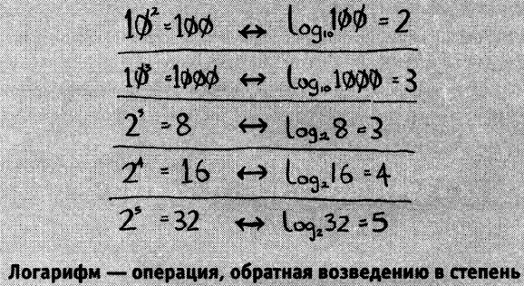

# Algorithms

---
## Общая информация

***Алгоритмом*** называется набор инструкций для выполнения некоторой задачи. 

---
## Бинарный поиск

Бинарный поиск - это поиск при котором целевой диапазон вариантов каждый раз делится пополам.

Бинарный поиск ***работает*** только, если список отсортирован!

Логарифм по основанию ***a*** от аргумента ***x*** — это степень, в которую надо возвести число ***a***, чтобы получить число ***x***.

 

 

Для поиска по списку из 8 чисел понадобиться не более log 8 = 3 чисел т.к. 2 в 3 степени = 8. Тогда для списка из 1024 элементов log 1024 = 10 чисел. 2 в степени 10 = 1024

