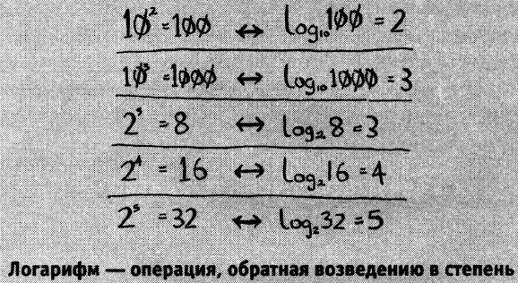
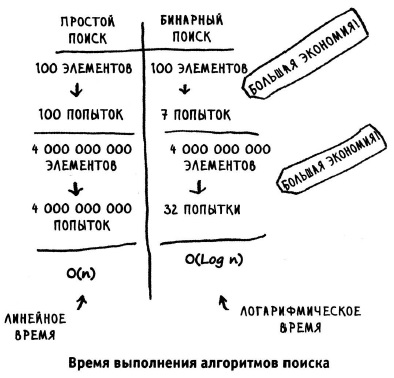

# Algorithms

---
## Общая информация

***Алгоритмом*** называется набор инструкций для выполнения некоторой задачи. 

***О - большое*** - специальная нотация описывающая скорость работы алгоритма.

---
## Бинарный поиск

Бинарный поиск - это поиск при котором целевой диапазон вариантов каждый раз делится пополам.

Бинарный поиск ***работает*** только, если список отсортирован!

***Логарифм*** по основанию ***a*** от аргумента ***x*** — это степень, в которую надо возвести число ***a***, чтобы получить число ***x***.

Обозначение: log<sub>a</sub>x = b, где a — основание, x — аргумент, b — собственно, чему равен логарифм.

 

 

Для поиска по списку из 8 чисел понадобиться не более log 8 = 3 чисел т.к. 2 в 3 степени = 8. Тогда для списка из 1024 элементов log 1024 = 10 чисел. 2 в степени 10 = 1024

Бинарный поиск код :

***javascript***
```js
function binarySearch(list, item) {     // функция бинарного поиска
    var iterations = 0;                 // количество проходов цикла
    var mid;                            // средний индекс массива
    var low = 0;                        // стартовый индекс
    var high = list.length-1;           // конечный индекс
    
    while(low <= high) {
        mid = Math.floor((low+high)/2); // расчет среднего индекса
        iterations++;

        if(item < list[mid]){           // если искомое число меньше среднего индекса
            high = --mid;
        } else if(item > list[mid]) {   // есди искомое число больше среднего индекса
            low = ++mid;
        } else {                        // искомое число найденно
            console.log('iterations = ' + iterations);
            return mid;
        }
    }
    return null;                        // искомое число не найденно
}

var a = 33;
var b = [3, 4, 5, 11, 14, 15, 22, 23, 25, 28, 33, 77];

console.log('number = ' + a);
console.log('array = ' + b);

var result = binarySearch(b, a);

console.log("binarySearch result = " + result);
```

 

---
## О-большое O(n)

O(n) - описывает, насколько быстро работает алгоритм.
O(n) - такая запись сообщает количество операций, которые придется выполнить алгоритму.

Имея список размерностью n, линейному поиску потребуется n операций или O(n), при бинарном же поиске потребуется `log n` операций или O(log n).